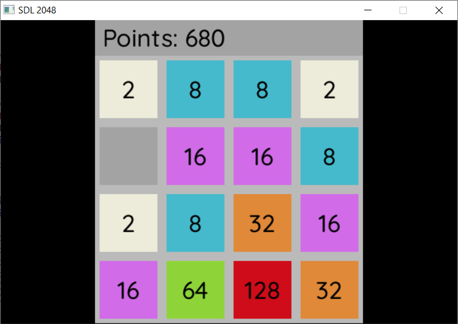
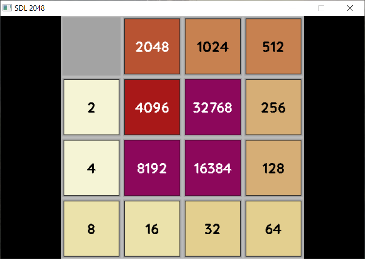
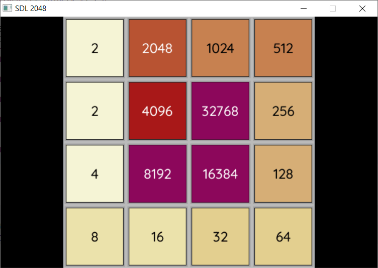
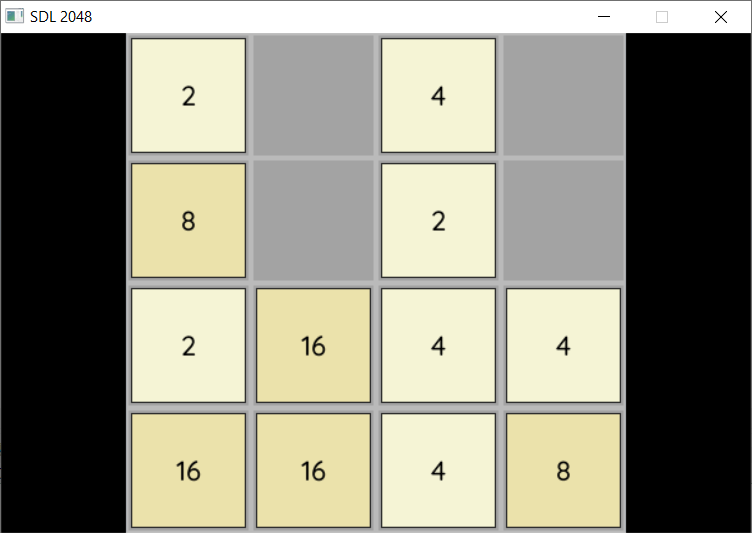

# SDL 2048

Attempt to make 2048 game with SDL and C++.

## Worklog
 - [x] Setup stable game loop.
 - [x] Render board.
 - [x] Render pieces with texts.
 - [x] Control and gameplay.
 - [x] Text antyaliasing.
 - [ ] Controller board.
 - [ ] Animation on pieces move.
 - [ ] Animation on new piece popup.
 - [ ] Difficulty levels.
 - [ ] Rounded corners (probably caching).


## Tools
 - [SDL](https://github.com/libsdl-org/SDL/releases)
 - [SDL TTF](https://github.com/libsdl-org/SDL_ttf/releases)


## Project setup on Windows
Comming soon

## Worklog

Recent progress:



### Setup board and pieces

[16.11.2022] Changelog:
 - Added separated abstraction for board and separate rendering.



### Gameplay

[17.11.2022] Changelog:
 - Added controller and new pieces generator. 
 - Text antialiasing enabled.
 - Bugfix: pieces merge searching entire row/column (teleporting pieceses).
 - Bugfix: new piece generated at every move (even when nothing happen).
 

 


Resulting points are in text so far:

```text
INFO: Got 18 points! Total 42
INFO: Got 20 points! Total 62
INFO: Got 10 points! Total 72
INFO: Got 8 points! Total 80
```

### Graphics update

[17.11.2022] Changelog:
 - Added new coolors with more contrast.
 - Added minor tweaks in the board rendering.
 - Added controller with points depicted.


### Animations update

[18.11.2022] Changelog:
 - Added move, merge, creation animations.
 - Bug: merging 4 pieces at once.
 - Bug: generating new piece after each move.